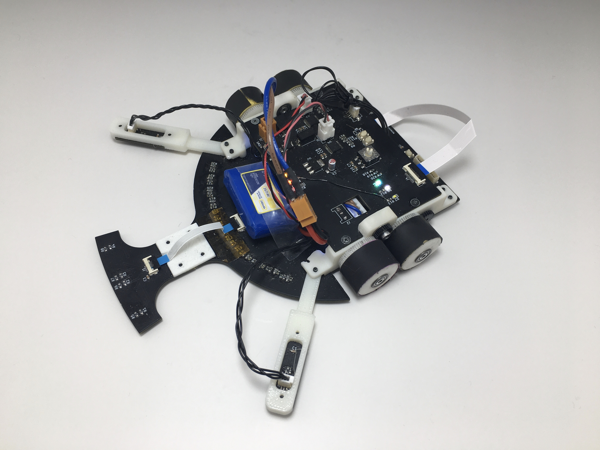

<!-- 改行を挟む必要がある -->
# 自己紹介
## 2023/04/20
## 千葉工業大学 上田研究室
## 21C1036 川原 脩慈

---

### もくじ

- プロフィール
- 何した人
- 何する人

---

### プロフィール
- 本名：川原 脩慈（カワハラ シュウジ）
- あだ名：矢澤
- 身長：177.7 (0.3↓) [cm]
- 体重：56.00 (0.1↓) [kg]
- BMI：17.73
- 出身：**川崎**生まれ**川崎**育ちの**川崎**住み
- 好きなこと：寝ること・食べること

--

# コミュ障

話しかけられると喜びます

よかったら仲良くしてあげてください

---

### 何した人？

--

---

### 何をする人？

--

ロボット×確率

でなんかおもろい研究したい（漠然）

---

